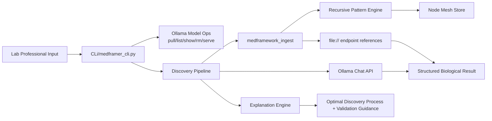

# MedFramer Autonomous Agent Specification
## Objective
Build an autonomous, Ollama-backed medical/biological discovery assistant with a professional chat interface for lab-grade users. The system must preserve and extend the existing folder layout: `asi core`, `CLi`, and `medframeworks`.
## Preserved Structure Contract
- `CLi/` owns user entrypoints and command workflows.
- `asi core/` owns autonomous processing logic (Light ASI Core modules).
- `medframeworks/` remains the biological data/process source tree that is ingested as structured context.
## External References (researched)
- Hostinger Ollama CLI tutorial: `https://www.hostinger.com/in/tutorials/ollama-cli-tutorial`
- Agent-97 repository shape: `https://github.com/JlovesYouGit/agent-97`
## Functional Requirements
1. Provide a CLI chat interface for professional users to interact with downloaded Ollama models.
2. Support local model management (pull/list/show/remove/serve) with a project-local model store path.
3. Ingest `medframeworks` files into a structured endpoint-aware context layer.
4. Extract recursive medical/biological patterns and persist a node-mesh graph artifact.
5. Generate working structured outputs (analysis/protocol/code) and explain the optimal discovery process.
6. Return traceable references to ingested file endpoints used during reasoning.
## Architecture

## Project File Graph
```text
BIO/
├── CLi/
│   ├── __init__.py
│   └── medframer_cli.py
├── asi core/
│   └── light_asi_core/
│       ├── __init__.py
│       ├── config.py
│       ├── types.py
│       ├── utils.py
│       ├── medframework_ingest.py
│       ├── pattern_engine.py
│       ├── node_mesh.py
│       ├── ollama_client.py
│       ├── explanation_engine.py
│       └── discovery_agent.py
└── MEDFRAMER_AGENT_SPEC.md
```
## Task List
1. Implement CLI command surface and local model-store bootstrap.
2. Add Ollama transport layer for chat and model metadata.
3. Add medframework ingestion with endpoint URL generation.
4. Add recursive pattern extraction and signal ranking.
5. Add node-mesh persistence for document/term/co-occurrence links.
6. Add autonomous discovery orchestration and structured output normalization.
7. Add explanation module for process transparency and evidence mapping.
8. Add repository hygiene rules to exclude model weights and cache artifacts.
9. Validate Python syntax and command wiring; then commit/push.
## Acceptance Mapping
- Input from lab-grade users: satisfied by interactive and one-shot CLI chat/discovery commands.
- Working biological outputs: satisfied by structured `working_result` payload generation.
- Discovery explanation: satisfied by explanation module + explicit process steps + evidence references.
- Strict structure adherence: satisfied by preserving and extending the existing top-level directories.
